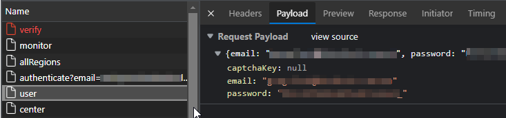

A SIEM typically collects event data, run detections, generates alerts and serves as a single pane of glass for security alerts. One of the fundamental types of event to ingest is malware alerts from endpoint antivirus and EDR solutions. Malware alerts may seem dull - no user behaviour analytics, no machine learning, but we very often read incident response reports where an attacker triggered AV/EDR alerts that were completely ignored, before eventually executing ransomware attack or exfiltrating data.

Some products make this easy - cloud-managed solutions might provide an API to poll for new alerts, on-prem products might write events to an event log or log file. Others might let you configure them to send an email or contact a webhook to notify you about a detection.

Some products make this much harder than it should be. In this post we'll look at Check Point Harmony (CPH), which presents the following challenges:
1. An API that doesn't currently support polling for EDR detections
2. Email notifications that can't be used to alert on every detection as they have thresholds that can't be set lower than 2
3. A syslog-over-the-internet approach, recommended by Check Point, but apparently not relevant if an organisation has no on-prem management servers

## The Query Process

What CPH *does* let you do is view detections ('active attacks') through its Infinity Portal web site - here we see the Threat Hunting tab list 2 'active attacks' i.e. open alerts based on detections:


Drilling down on those 2 alerts:


Modern websites commonly use a [Single Page Application](https://en.wikipedia.org/wiki/Single-page_application) approach where client-side JavaScript code is used to access backend APIs as a user interacts with the web application, avoiding the need for full page refreshes and (usually) resulting in better interactive experience for the user.

If we hit F12 to open the browser's dev tools, open the Network tab and refresh the page, we can watch for Fetch/XmlHttpRequest requests made when the page loads. Searching all content for a distinctive value shown on the web page (e.g. `nvio.x64.exe`) we see a response from `prod-gcp-apollo/` that returns JSON data containing full details of the detection - to be rendered client-side:


The payload in the request that generated this content shows that a query string was submitted, along with parameters controlling date ranges, result order and pagination: 


So now we know we know which endpoint (`prod-gcp-apollo/`) to query, the method (POST), the body of the request, and what the response looks like.

All that remains is to analyse the authentication process, then recreate the two steps (authenticate, query) in a scheduled script that outputs the results to our SIEM.

## Authentication

Let's apply the same process to analyse authentication. Check Point provides options to manage API keys, however, the API doesn't yet support what we're trying to query. We'll need to use a user account acting as a service account (ideally with least privileges and a complex password).

When we browse to https://ap.portal.checkpoint.com/signin we're prompted for a username, then a password. The Network tab shows a POST against `/auth/user`:



We can see the server response included a directive to set a `cloudinfra` cookie - a signed [JWT](https://en.wikipedia.org/wiki/JSON_Web_Token) - containing assertions about our identity and permissions:


In addition, towards the end of the response we see a value called `csrf` - a Cross Site Request Forgery ([CSRF](https://en.wikipedia.org/wiki/Cross-site_request_forgery))) token with an expiry of 900 seconds (15 minutes):


The browser will automatically include our cookie in subsequent requests to the same origin (https://ap.portal.checkpoint.com). It's likely the server will also expect the CSRF token to be included and will validate that the token corresponds to our session - and potentially the code submitting the request.

Looking at subsequent requests - including the one to retrieve active attacks, we see the same CSRF token appear as a custom HTTP header in the request:


We now know how to authenticate with a username and password, and how to use the returned values (cookie, CSRF token) for subsequent authenticated requests.

## Scripting

We'll develop our script in a Python module, independent of the specific SIEM we're working with (Splunk). This way, the majority of the code can be tested outside of Splunk, and could be re-used without modification for any other SIEM.

The code below shows the login process - including the request, storing the resulting cookies through use of the Requests' library's Session object, and manually setting an X-Access-Token header value based on the value of `csrf` in the response to our authentication request:

```python
def login(self):
	login_uri = "/auth/user"

	payload = {
		"email": self.username,
		"password": self.password,
		"captchaKey": "null",
	}

	# Login
	url = self.cloudinfra_gw_url + login_uri
	response = self.session.post(url=url, verify=False, json=payload)
	logger.info(f"Status code from login: {response.status_code}")

	if response.status_code != 200:
		return False
	else:
		self.csrf_token = response.json()["csrf"]
		self.session.headers.update({"X-Access-Token": self.csrf_token})

	return True
```

The code below generates timestamps for our search window, submits a request and returns any matching records included in the response. Note that we're using the same Session object from before so our requests include the `cloudinfra` cookie and X-Access-Token header required for authentication: 

```python
def query_active_attacks(self, hours_ago):
	threat_hunt_uri = "/app/threathunting/prod-gcp-apollo/"
	threat_dash_uri = "/dashboard/endpoint/threathunting#/search"

	# Prepare the query endpoint URL
	url = self.cloudinfra_gw_url + threat_hunt_uri

	current_time = (
		datetime.now(timezone.utc)
		.isoformat(timespec="milliseconds")
		.replace("+00:00", "Z")
	)
	earliest_time = (
		(datetime.now(timezone.utc) - timedelta(hours=int(hours_ago)))
		.isoformat(timespec="milliseconds")
		.replace("+00:00", "Z")
	)

	# Prepare query
	payload = cpharmony_consts.TH_ACTIVE_ATTACKS_PAYLOAD
	payload["variables"]["queryParam"]["dateRange"]["from"] = earliest_time
	payload["variables"]["queryParam"]["dateRange"]["to"] = current_time

	# Get detections
	payload_str = json.dumps(payload, separators=(",", ":"))
	payload_str = payload_str.replace('"null"', "null")
	response = self.session.post(url=url, verify=False, data=payload_str)

	if response.status_code != 200:
		logger.error(response.text)
		return []
	else:
		logger.debug(response.json()["data"]["searchRecords"]["metadata"])

	if response.json()["data"]["searchRecords"]["metadata"]["totalRows"] > 0:
		return response.json()["data"]["searchRecords"]["records"]
	else:
		return []
	return response.json()
```

Full code is available here: https://github.com/gf13579/ta_for_cpharmony.

## SIEM Integration

We'll place our authentication and query code in a `cpharmony_connector` class and call it from within a script used by Splunk for modular inputs:

```python
# ...
cp_connector = cpharmony_connector(
	username=username, password=password, region=region, verify=True
)

if not cp_connector.login():
	logger.error("Failed to login")
	return

results = cp_connector.query_active_attacks(hours_ago=hours_ago)

for r in results:
	event = Event()
	event.stanza = stanza
	event.data = json.dumps(r)
	ew.write_event(event)
```

Finally, we can use the following Splunk-specific `props.conf` configuration settings to tell Splunk how to parse the timestamp from the raw JSON of each event:

```toml
[checkpoint:harmony:json]
TIME_FORMAT=%s%3N
MAX_TIMESTAMP_LOOKAHEAD=13
TIME_PREFIX=OpTimeUTC":\s
...
```

These settings help Splunk parse a millisecond-level epoch-based datetime value like `"OpTimeUTC": 1669271153062`

The focus of this post is on analysing and scripting the API used by a single page application - rather than developing a Splunk add-on. Notable resources are listed below, and the full add-on can be downloaded from [Splunkbase](https://splunkbase.splunk.com/) or [GitHub](https://github.com/gf13579/ta_for_cpharmony).

| Feature                                  | Purpose                                        | Link                                                                                                                            |     |
| ---------------------------------------- | ---------------------------------------------- | ------------------------------------------------------------------------------------------------------------------------------- | --- |
| Simple setup page                        | Handle password.conf updates with minimal code | [setup_page_simple (Splunk on GitHub)](https://github.com/splunk/splunk-app-examples/tree/master/setup_pages/setup_page_simple) |     |
| splunk-sdk-python random_numbers example | Simple modular input example                   | [random_numbers (Splunk on GitHub)](https://github.com/splunk/splunk-app-examples/tree/master/modularinputs/python/random_numbers)                 |     |
| Loguru                                   | Python logging made simple          | [loguru (GitHub)](https://github.com/Delgan/loguru)  |                                                                                                                              |     |

## Splunk Configuration

Once installed, the add-on should be setup with a password using the simple setup page:


Then create a new Data Input:


## SIEM Alerts

Since we're using a poll-based approach with no checkpoint, our scheduled query may well end up ingesting duplicate events. This is fine - we just need to dedupe these before using them in a dashboard or alert.

When we build our detection for Splunk ES we'll dedupe based on `DetectionEvent.DetectionIncidentId` and use `props.conf` to normalise the field names a little to comply as best as possible with Splunk's Common Information Model (CIM), ensuring that
- The most relevant fields are exposed to the analyst;
- Splunk-authored detections can operate over the event data with minimal changes;
- Asset and identity correlation is performed automatically

When the detection fires we see our Check Point-generated alerts exposed in the SIEM - exposing key fields to the analyst, enriched with user and endpoint inventory information, and impacting risk scores on the asset and identities involved in the detection:


## Wrapping Up

We overcame a frustrating lack of integration support in a vendor product by scripting the process used by an interactive user. The API-based architecture of the vendor's web application greatly simplified the task, and meant we could do most of the analysis and scripting using standard browser dev tools and a very small amount of Python.

One final point to note - we're using an undocumented API that's intended for Check Point's own web application; so there's a chance the API will change and our code will break. However, this is true even of documented and supported APIs - and one of many reasons to monitor the health of  SIEM log sources. Hopefully Check Point will introduce support for API-based alert integration in the near future. 