Security automation typically involves making connections to services - typically REST APIs both internal (e.g AD) and external (e.g. VirusTotal). Splunk's SOAR solution has a [large library of apps](https://github.com/splunk-soar-connectors) but it's a pretty common requirement to connect to a service that doesn't yet have an app.

SOAR makes it fairly easy to develop custom apps (connectors), which help abstract away some of the pain points of working with an API - including authentication, pagination, transformation of returned content and error handling. SOAR's App Wizard is an excellent tool for generating the bare bones of an app, including a lot of boilerplate code and comments that help explain what needs to be done to make the app useful.

While SOAR makes heavy use of Git for version control of playbooks, it doesn't use Git for apps. In addition, the Wizard's code editor is functional, but lacks standard IDE features like linting and autocompletion, and quickly becomes frustrating to work with.

In this post we'll use the Wizard to generate an app in our lab instance of SOAR, then switch to VS Code - editing remotely over SSH - and Git to further develop and manage the application whilst making it easy to apply changes for testing. Once deployed, the resulting app is still compatible with the Wizard - tactical changes could be made using SOAR's UI, if required.

In addition to the benefits of a full IDE and source code control, we'll use Git hooks to trigger code validation on commit, highlighting problems to fix before deploying and testing the change.

## Create a New App Using the Wizard

Use Apps->App Wizard to create a new app. Hover over the question marks for useful guidance:

[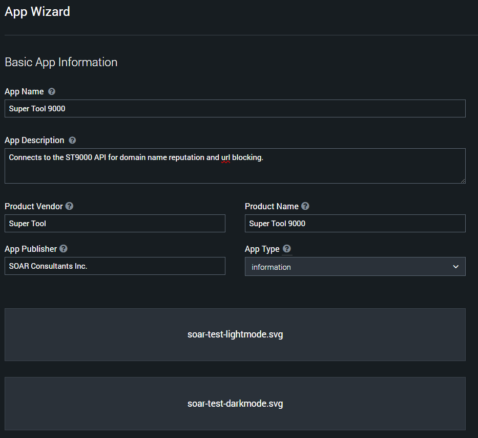](appwiz-example.png)

Add at least one action - ideally all the actions you expect to need to develop:

[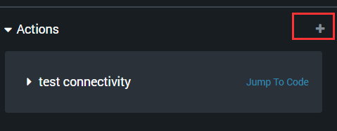](appwiz-add-action.png)

Configure the action. Don’t worry about the REST Endpoint parameter being correct - you can modify it later, and you may well choose not to use the autogenerated code.

[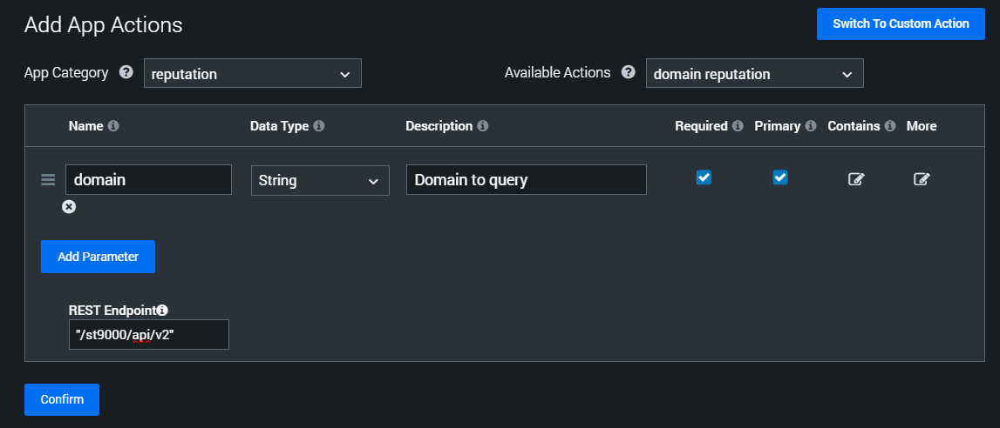](appwiz-add-action-example.png)

Save and publish the app:

[](appwiz-save-and-publish.png)

At this point we have a new app folder within .../soar/apps/

```bash
ls -rlta | tail -n 1
phantom phantom   215 Feb 28 11:17 supertool9000_fbaeb1b3-fbe4-4356-a3c8-7e9b35986832
```


Notable files:

- supertool9000.json
- supertool9000_consts.py
- supertool9000_connector.py
- readme.html


## Moving to VS Code and Git

Copy the current version to a working folder:

```bash
cp -r /opt/soar/apps/supertool9000_fbaeb1b3-fbe4-4356-a3c8-7e9b35986832/ ~/supertool9000_working
```

Use VS Code to open that folder remotely over SSH:

[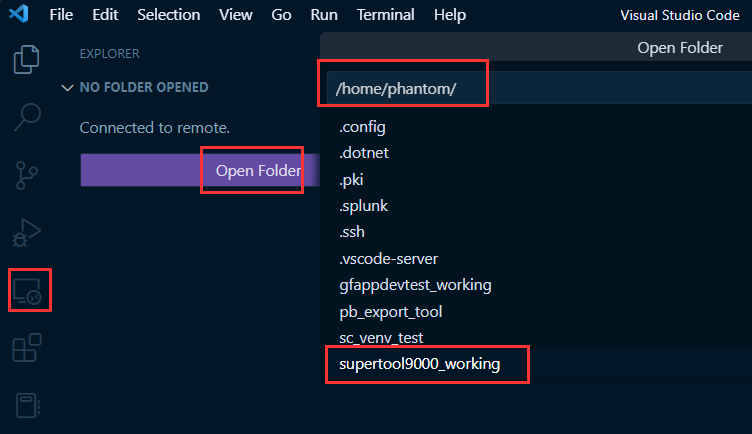](vscode-remote-open-folder.png)

Create a .gitignore file containing:

```
__pycache__/*
*.py[cod]
```

Initialise the folder as a Git repo:

[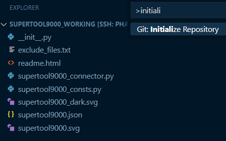](vscode-initialize-as-repo.png)

You may need to re-open the folder for VS Code to recognise this folder as being a repo, at which point you’ll have pending changes to commit:

[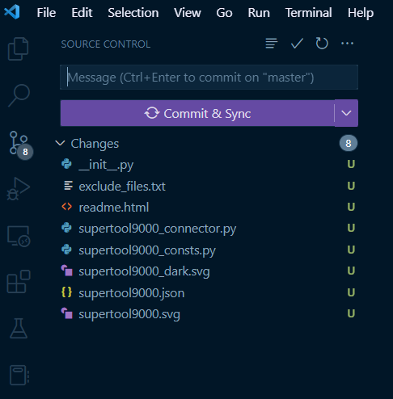](vscode-commit.png)

Add a remote origin, or just use Code’s convenient support for publishing to GitHub:

[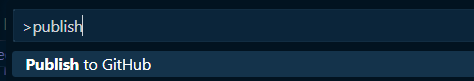]([publish-to-github].png)

Create a hooks folder under `.git/` and create two files:

[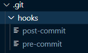](vscode-hooks.png)

Make them executable - note that you can just use the terminal within VS Code:

[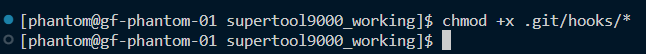](vscode-chmod.png)

Populate the files: `pre-commit`:

```python
#!/opt/soar/usr/bin/python3

import subprocess
import sys

result = subprocess.run(["phenv", "compile_app", "-c", "--no-color"],
                        capture_output=False, text=True)
print(result.stdout)
print(result.stderr, file=sys.stderr)
exit(result.returncode)
```

and `post-commit`

```python
#!/opt/soar/usr/bin/python3


import json
import glob
import re
import subprocess
import tempfile
from shutil import copytree, copy2, ignore_patterns
import sys


def increment_ver(version):
    version = version.split('.')
    version[2] = str(int(version[2]) + 1)
    return '.'.join(version)


file_name = re.sub("_connector.py", ".json", glob.glob("*_connector.py")[0])
config = {}
with open(file_name, mode='r') as f:
    config = json.loads(f.read())

config['app_version'] = increment_ver(config['app_version'])

with open(file_name, mode='w') as f:
    f.write(json.dumps(config))

with tempfile.TemporaryDirectory() as dirpath:
    copytree(".", dirpath, symlinks=False, ignore=ignore_patterns('.git*'),
             copy_function=copy2, ignore_dangling_symlinks=False, dirs_exist_ok=True)
    result = subprocess.run(["phenv", "compile_app", "-i", "--no-color"],
                            capture_output=True, text=True, cwd=dirpath)
    print(result.stdout)
    print(result.stderr, file=sys.stderr)
    exit(result.returncode)
```

The `pre-commit` app compile action should cause the commit to fail - with the `compile_app` output visible in the Git log - if there’s a problem compiling the app.

To test the commit/compile workflow:

1. Confirm the value of app_version in your app's .json file.
2. Confirm the version visible within the SOAR web UI
3. Make an arbitrary change to your connector’s [appname]_connector.py file e.g. add a `# comment`
4. Make a commit within VS Code
5. Confirm the latest patch version within the web UI has been incremented

Notes:

- The patch version will always end up one greater in the local copy of the app’s json config file i.e. pending a commit i.e. think of this version as being the next version of the app you’re working on
- If you ever want to update the major or minor versions in the semantic version (major.minor.patch), do so manually

Basic errors will cause app compilation - and thus the pre-commit check - to fail:

[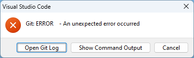](git-error-on-commit.png)

The log gives us more details and a link to the offending code:

[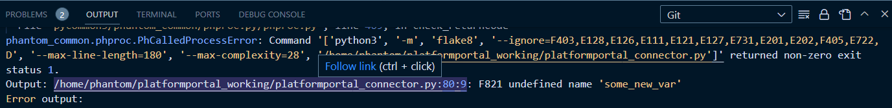](git-error-on-commit-log.png)

Note that we could've made use of a linter in Code to identify the issue before compiling the code:

[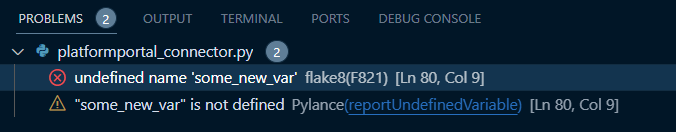](linting-errors.png)

Add `# type ignore` to tell VS Code’s Pylance language server to ignore errors importing Phantom (SOAR) modules:

```python
import phantom.app as phantom  # type: ignore
from phantom.base_connector import BaseConnector  # type: ignore
from phantom.action_result import ActionResult  # type: ignore
```

## Tactical Deployment for quick code change tests

Rather than commit and compile the app for every single code change, let's add a build task that will all .py files over from the working directory to the app's directory within `/opt/soar/apps`:

Use Code's command palette to create a task - or just create `.vscode/tasks.json`:

```json
{
    "version": "2.0.0",
    "tasks": [
        {
            "label": "Copy py files to live soar app folder",
            "type": "shell",
            "command": "which jq && cp *.py $(echo \"/opt/soar/apps/$(jq .directory $(ls *_connector.py | sed \"s/_connector.py/.json/\") -r)\")/",
            "problemMatcher": [],
            "group": {
                "kind": "build",
                "isDefault": true
            }
        }
    ]
}
```

We can now use Run Build Task (<kbd>Ctrl</kbd> + <kbd>Shift</kbd> + <kbd>B</kbd>) to quickly update the Python files directly within our running SOAR instance's `/apps` directory.

The `command` above is a bash one-liner that:
- Confirms `jq` is available
- Gets the app name from [appname]_connector.py
- Uses that name to retrieve the app's json config file
- Uses `jq` to parse the value of `directory` i.e. the appname_[guid] value
- Copies .py files from the current folder to that app directory within `/opt/soar/apps` (hard coded - change as required)


## Adding Dependencies

The App Wizard supports adding dependencies - as pypi references or manual wheel (.whl) file uploads.

To add a pypi dependency outside of the Wizard, add/edit the following property in the root of the app’s json config file:

```json
"pip3_dependencies": {
    "pypi": [
        {
            "module": "xmltodict"
        }
    ]
}
```

Compiling the app with `compile_app` should result in the relevant dependencies being downloaded and placed in a `/dependencies` directory, created if it didn’t already exist. This directory is populated for the installed copy of the application - under `[path_to_soar]/apps/[app_name]_[guid]`.


## Specifying Output Data Paths

Adding output data paths - even within the App Wizard’s UI - involves manually updating the app’s json-based config file. 

If the API call returns a list of objects, each with an `id` value, here’s how we might represent that in the app’s json file, so that SOAR’s playbook editor offers the developer known action result paths within the UI:

```json
"output": [
    {
        "data_path": "action_result.parameter.ip",
        "data_type": "string",
        "contains": [
            "ip"
        ],
        "column_name": "IP (Parameter)",
        "column_order": 0
    },
    {
        "data_path": "action_result.data.*.id",
        "data_type": "numeric",
        "column_name": "ID",
        "column_order": 1
    },
```

## Making REST Calls - Wizard-generated Code

The SOAR App Wizard generates a lot of skeleton code including utility functions designed to simplify making REST calls and handling responses. Most of this code can safely be deleted if you’re choosing to handle this yourself - e.g. using a separate Python module that abstracts the complexity of connecting to a given service. Functions that could be removed include:

- _process_empty_response
- _process_html_response
- _process_json_response
- _process_response
- _make_rest_call

## Summary

In this article we created a SOAR app within the UI then switched to further the develop it in VS Code and manage the codebase in Git. Future posts may cover remote debugging and CI/CD.

Check out Splunk's [documentation](https://docs.splunk.com/Documentation/SOAR/current/DevelopApps/Overview), which covers much of what's required to make an app useful, including a full API reference and functional tutorial to develop a connector for ipinfo.io from scratch. Also take a look at their [VS Code Extension](https://marketplace.visualstudio.com/items?itemName=Splunk.vscode-splunk-soar) for further interacting with your SOAR instance during development.